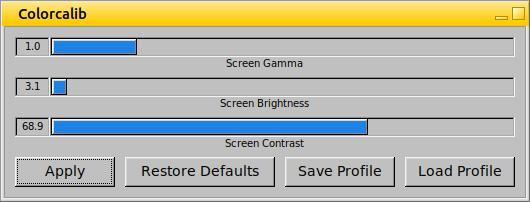
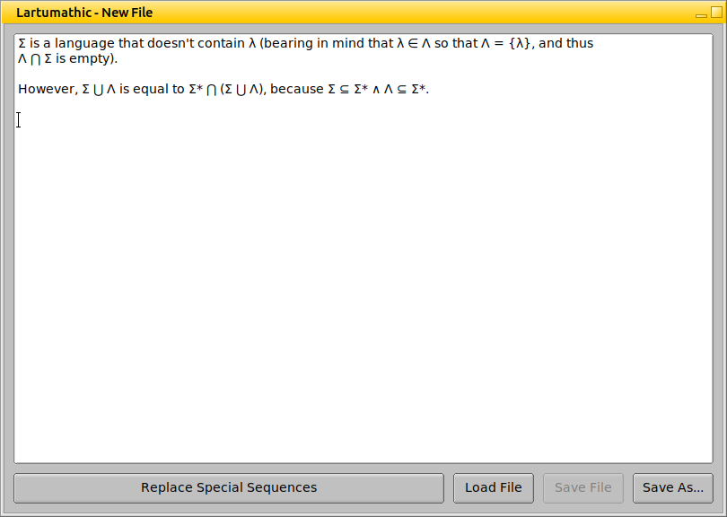

# LDPL FLTK 🦕

LDPL FLTK is a [GUI](https://en.wikipedia.org/wiki/Graphical_user_interface) library for the
[LDPL programming language](https://www.ldpl-lang.org/). It lets you create graphical user
interfaces with maximum ease. It is a simple [FLTK](https://fltk.org) wrapper
designed to make GUI building easy to learn and to extend.

At the moment this library supports:
- Multiple, fixed-size windows
- Buttons
- Check buttons
- Radio buttons
- Horizontal and vertical sliders (both with handle and fill-sliders, with and without value text)
- Setting maximum, minimum and step value for sliders.
- Labels
- Text entry areas (single line)
- Text output areas (single line)
- Text entry areas (multiline)
- Text output areas (multiline)
- Setting text area wrap mode
- Multiple themes
- Moving widgets
- Scaling widgets
- Setting and getting widget text
- Setting and getting widget values
- Enabling and disabling widgets
- Showing and hiding widgets
- Styling some widgets
- Message Dialog
- Question Dialog
- File Chooser Dialog
- Probably more stuff

What this library should support in the future:
- [ ] Resizeable windows
- [ ] Callback for the close button
- [ ] Color picker dialog
- [ ] Keyboard shortcuts (e.g., Control + S)
- [ ] Dropdowns
- [ ] Treeviews
- [ ] Setting label text size

# Usage

You will first have to build and install FLTK to your computer (download FLTK from [here](https://www.fltk.org/software.php),
uncompress the downloaded package, `cd` into the extracted folder, do `./configure`, `make` and `make install`. Done!). Once
FLTK is installed, add the line

```include "ldpl-fltk/fltk.ldpl"```

to your project, before the `data:` section.

As a documentation has not been written yet (*yet!*), refer to the [examples](examples) and the file [fltk.ldpl](ldpl-fltk/fltk.ldpl) for more information
on how to use this library.

# Screenshots


From the [Colorcalib](examples/colorcalib) example.



From the [Lartumathic](examples/lartumathic) example.

# License

The LDPL FLTK library is released under the MIT license. The Fast Light ToolKit is released under the GPL license.
