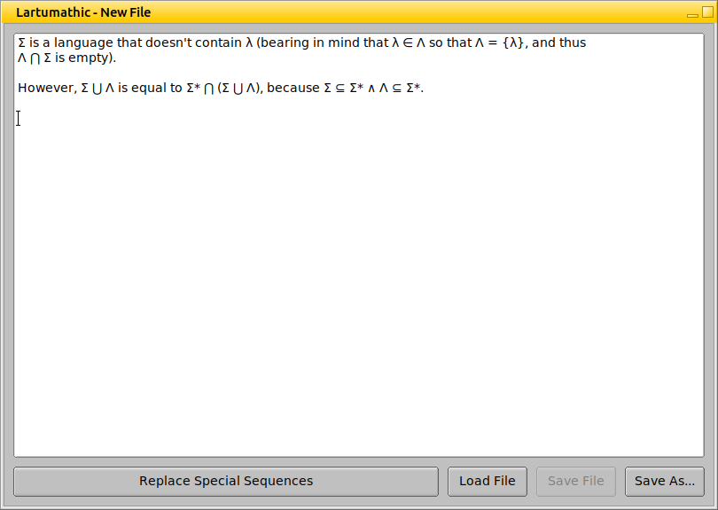

# Lartumathic

**Lartumathic** is a tool written in LDPL that lets replace special sequences
of text (defined in the source file) for special characters that are
not always easy to type (for example, :subset: turns into ⊆).

